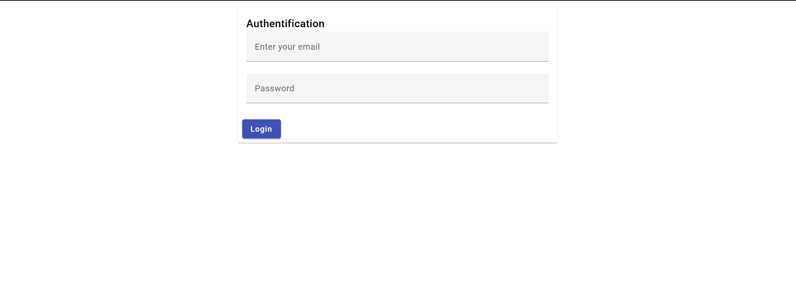
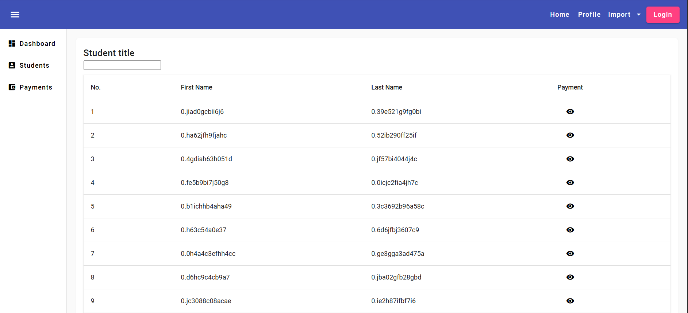
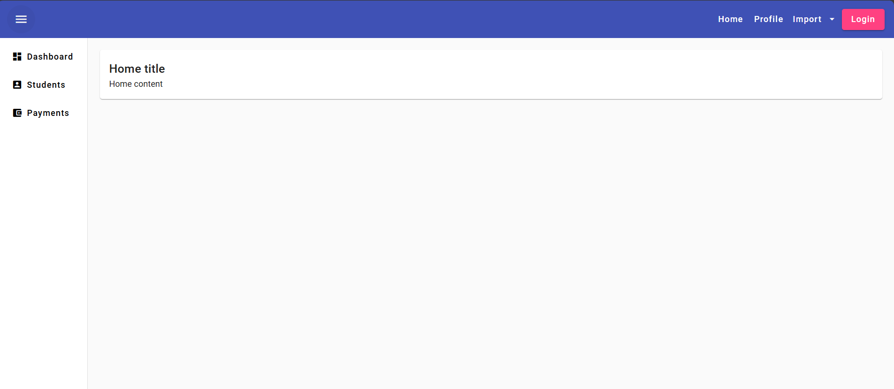

# FrontAngular

Frontend avec angular basé sur Angular Material

## Use project

1. Run frontend
- Clone project: `git clone https://github.com/x99155/student-app.git`
- Go to front: `cd frontend`
- Install dep: `npm install`
- Run front: `ng serve` then go to `localhost:4200/admin/home`

1. Run backend
- Go to back: `cd frontend`
- Run app: `./mvnw spring-boot:run`
- Go to `localhost:9000/swagger-ui/index.html`

**NB:** 
*I used h2-database, no need to config, run the project then go to http://localhost:9000/h2-console/ no password need.
If you want to use another database like mariadb. In properties file, juste decomment corresponding lines and comment h2-db config lines*

----------------------------------------------------

## Licenses
Free to use as your wishes bro/sis

